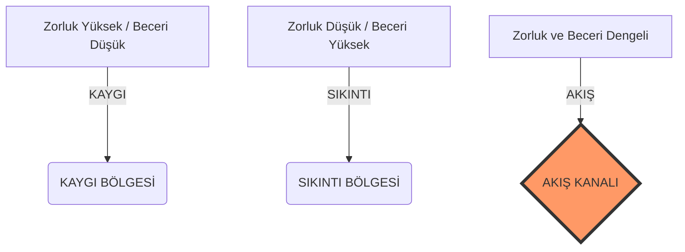

# İçsel Motivasyon Notları 🧠⚡

Bu depo; içsel motivasyon, derin odaklanma ve insan potansiyelinin zirvesi olan **"Optimal Deneyim" (Akış)** konularını ele alan bir bilgi mimarisidir. Geleneksel "havuç-sopa" yöntemlerinin ötesine geçerek, bir işi sadece o işi yapmanın verdiği haz için yapma sanatını teorik bir temelden alıp pratik bir sisteme dönüştürmeyi hedefler.

---

## 🏛️ Felsefi Temel ve Vizyon

Modern dünya, bizi sürekli dışsal ödüllere (statü, para, onaylanma) odaklanmaya iterken, içsel tatminimizi ve yaratıcılığımızı köreltmektedir. Bu depo, **Daniel H. Pink**'in "Drive" ve **Mihaly Csikszentmihalyi**'nin "Akış" teorilerini sentezleyerek şu temel vizyonu savunur:

> *"Gerçek başarı, bir varış noktası değil; becerilerinizin sınırlarında dans ettiğiniz o sonsuz 'şimdi' anıdır."*

### Neden Bu Repo?
*   **Bilişsel Özgürlük:** Dışsal denetimden kurtulup kendi motivasyon kaynağınızı keşfetmek için.
*   **Derin Çalışma (Deep Work):** Bilginin ve yaratıcılığın sığlaştığı bir çağda odaklanma gücünüzü geri kazanmak için.
*   **Sürdürülebilir Mutluluk:** Pasif eğlence yerine, aktif ve zorlayıcı aktivitelerden gelen gerçek mutluluğu inşa etmek için.

---

## 📚 İncelenen Temel Eserler

### 1. Drive: Bizi Neler Motive Eder? (Daniel H. Pink)
Pink, "Motivasyon 3.0" adını verdiği içsel işletim sisteminin üç temel ayağını tanımlar:

*   **Otonomi (Özerklik):** Hayatımızın direksiyonunda olma arzusu. (Görev, Zaman, Teknik ve Ekip üzerinde kontrol).
*   **Ustalık (Mastery):** Önem verdiğimiz bir konuda sürekli gelişme dürtüsü. Ustalık bir "zihin yapısı"dır ve çaba gerektirir.
*   **Amaç (Purpose):** Yaptığımız işin, kendi küçük dünyamızdan daha büyük bir şeye katkı sağladığı hissi.

### 2. Akış: Mutluluk Bilimi (Mihaly Csikszentmihalyi)
Akış, eylem ile farkındalığın birleştiği, zamanın eridiği o "bölgede" olma halidir.

#### 📉 Akış Kanalı Grafiği (Zorluk vs Beceri)
Akış, ancak beceri seviyeniz ile karşınıza çıkan zorluk dengelendiğinde ortaya çıkar:

---

## 📂 Depo Yapısı ve Gezinme

Klasörleme sistemi, teoriden pratiğe doğru akacak şekilde tasarlanmıştır:

| Klasör | İçerik | Amacı |
| :--- | :--- | :--- |
| [📁 01-ozetler](./01-ozetler) | Bölüm bazlı özetler ve zihin haritaları. | Teorik temeli hızlıca anlamak. |
| [📁 02-kavramlar](./02-kavramlar) | Glossary ve temel terimlerin açıklamaları. | Ortak bir dil oluşturmak. |
| [📁 03-uygulamalar](./03-uygulamalar) | Eylem adımları ve şablonlar. | Bilgiyi hayata entegre etmek. |
| [📁 04-zihniyet](./04-zihniyet-ve-alintilar) | İlham verici alıntılar ve perspektifler. | Kriz anlarında zihni hizalamak. |
| [📁 05-ek-kaynaklar](./05-ek-kaynaklar) | Makale, video ve kitap önerileri. | Öğrenmeyi derinleştirmek. |

---

## 🚀 Nasıl Kullanılır? (Yol Haritası)

1.  **Teşhis Koyun:** Mevcut işinizde veya hobinizde neden mutsuz olduğunuzu anlamak için [Drive Özetini](./01-ozetler/drive-ozet.md) okuyun (Otonomi, Ustalık veya Amaç mı eksik?).
2.  **Sözlüğü İnceleyin:** [Temel Kavramlar](./02-kavramlar/sozluk.md) bölümüne göz atarak terminolojiye hakim olun.
3.  **Harekete Geçin:** Bir sonraki çalışma seansınızdan önce [Akış Kontrol Listesi](./03-uygulamalar/akis-kontrol-listesi.md)'ni uygulayın.
4.  **Derinleşin:** [Ek Kaynaklar](./05-ek-kaynaklar/README.md) kısmındaki TED konuşmalarını izleyerek vizyonunuzu genişletin.

---

## 💡 Temel Çıkarımlar ve Mitler

*   ❌ **Mit:** Akış zahmetsizdir.
*   ✅ **Gerçek:** Akış, büyük bir zihinsel enerji ve "ustalık acısı" (pain of mastery) gerektirir.
*   ❌ **Mit:** Para en büyük motive edicidir.
*   ✅ **Gerçek:** Para bir "hijyen faktörü"dür. Yetersizse motivasyonu kırar, ancak yeterli olduğunda daha fazlası yaratıcılığı artırmaz.
*   ❌ **Mit:** Boş zaman dinlendiricidir.
*   ✅ **Gerçek:** Yapılandırılmamış boş zaman (pasif tüketim), zihnin entropiye (karmaşaya) girmesine neden olur. Aktif dinlenme (hobi, spor) daha verimlidir.

---

## 🤝 Katkı Sağlama (Contributing)

Bu repo, kolektif bir zihin kütüphanesidir. Kendi notlarınızı, deneyimlerinizi veya yeni kaynakları paylaşmak isterseniz `Pull Request` göndermekten çekinmeyin. Özellikle aşağıdaki konularda katkılarınızı bekliyoruz:
*   Kendi hayatınızdan "Akış" vakaları (Case Studies).
*   Üretkenlik araçlarının bu felsefeye göre yapılandırılması.
*   Görsel zihin haritaları (Mind Maps).

---

*Not: Bu çalışma, "Ustalık" yolculuğunda olan bir zihnin kendi notlarından derlenmiş olup, tüm "arayıcılar" için açık kaynak olarak sunulmuştur.*
